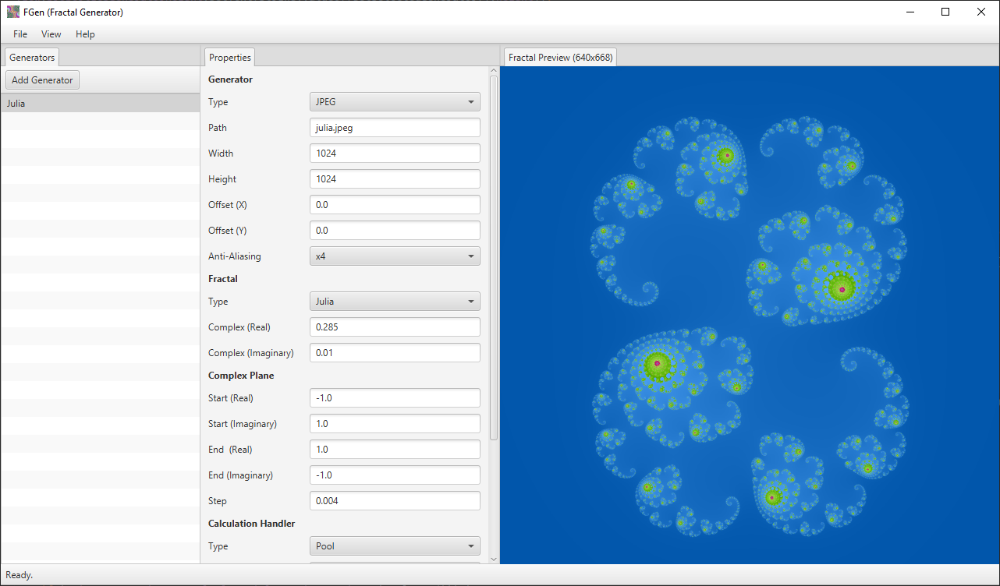
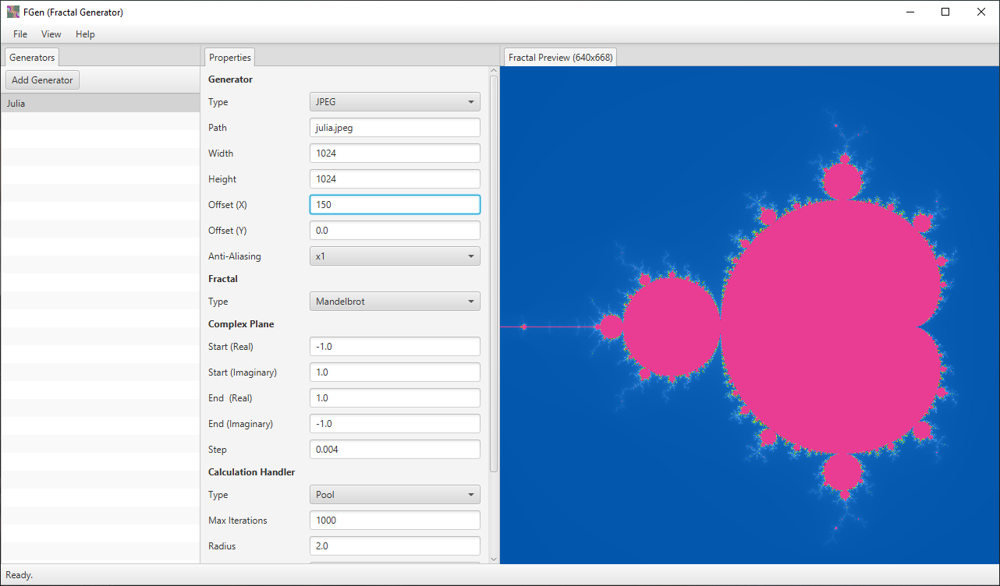
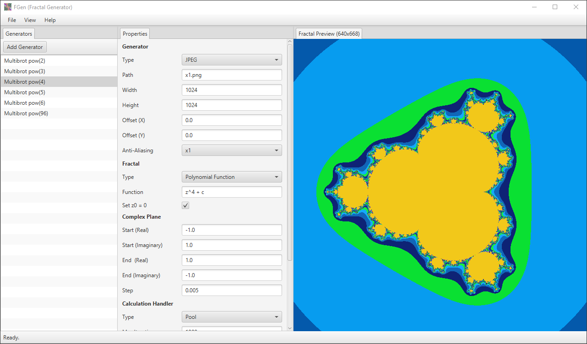

<div align="center">
  
</div>

# FGen (Fractal Generator)

FGen is a tool to generate various fractal based on a configuration file containing a list of generators (a generator is set of data to generate a fractal image), it can be used through a CLI by using various options or through a GUI.

## Screenshots

<div align="center">
    
    
    
</div>

## Features

- Usable in CLI or in GUI.
- Can be configured through configuration files.
- Ability to load/save configuration files or use presets.
- Generate Julia set fractals.
- Generate Mandelbrot set fractals.
- Generate any polynomial functions fractals.
- Save generated fractals as .jpeg, .png or even .gif (only available in CLI through configuration files).
- Can be multithreaded (in configuration files), which can lead from up to 4 times better performances depending on the fractal requirements !
- Use various color schemes.
- Ability to generate more beautiful fractals with anti-aliasing rendering.

## Architecture

Tree of the most important files and folder in the project's repository hierarchy (not everything is shown):

```
/
├─┬─src/: Source code.
│ └─┬─main/: Main package.
│   ├─┬─java/com/ustudents/fgen/: Program source code.
│   │ ├─┬─common/: The common source code (useful for other projects).
│   │ │ └─┬─benchmark/: Benchmark system.
│   │ │   ├─json/: JSON parser.
│   │ │   ├─logs/: Logging system.
│   │ │   ├─options/: CLI options parser.
│   │ │   ├─utils/: Various utility classes.
│   │ │   └─Program.java: Main class to extend from when creating a CLI program.
│   │ ├─fractals/: Every Fractal classes.
│   │ ├─generators/: Every Generator classes.
│   │ ├─┬─gui/: Every GUI related code.
│   │ │ └─┬─controller/: The MVC controllers.
│   │ │   ├─controls/: Custom JavaFX controls.
│   │ │   ├─views/: The MVC views.
│   │ │   └─Application.java: Main JavaFX class.
│   │ ├─┬─handlers/: Every handlers code.
│   │ │ └─┬─calculation/: Every calculation handlers (computing divergence indexes).
│   │ │   ├─color/: Every color handlers (computing pixel color per divergence indexes).
│   │ │   └─image/: Every image handlers (filling images).
│   │ ├─┬─maths/: Every maths related classes.
│   │ │ └─┬─Complex.java: Defines a Complex number.
│   │ │   ├─ComplexPlane.java: Defines a complex plane.
│   │ │   └─PolynomialFunctionParser.java: Parses a polynomial function.
│   │ ├─Configuration.java: Contains the configuration data format.
│   │ ├─FGen.java: Main logic of the program.
│   │ └─Main.java: Class containing the `main` function.
│   └─┬─resources/: The resources (included within the builded JAR).
│     └─presets/: Every presets of configuration fiels.
├─README.md: This file.
└─*.*: Other files.
```

Everything can be configured through configuration files, from what fractal to generate, to how it will be computed and rendered with a lot of details!

## How to use

### From sources

#### Compile with an IDE (if it supports Gradle):

1) Open the project's directory in your IDE.
2) Use the `run` gradle task (within the `application` gradle plugin).

#### Compile with the command line:

1) Open a terminal in your project directory.
2) Run gradle wrapper (it will download all dependencies, including gradle itself) `./gradlew build`.
3) You can finally run the project with `./gradlew run`.

### From a binary distribution

If you got a binary release, you can directly use `java -jar fgen.jar`.

### What can I do ?

If you have run the application like we saw before, you should have seen the documentation, if not, try to use `java -jar fgen.jar -h`.
Every command should be documented. The program will launch in CLI by default, if you want to be in GUI mode you need to start with `java -jar fgen.jar -t gui`.

## Third party libraries

- [JavaFX](https://openjfx.io/)  
  Client application platform for desktop.

## Contributors

- [KINDEL Hugo](https://gaufre.informatique.univ-paris-diderot.fr/hugokindel)
- [JAUROYON Maxime](https://gaufre.informatique.univ-paris-diderot.fr/jauroyon)

## License

This project is made for educational purposes only and any part of it can be used freely.